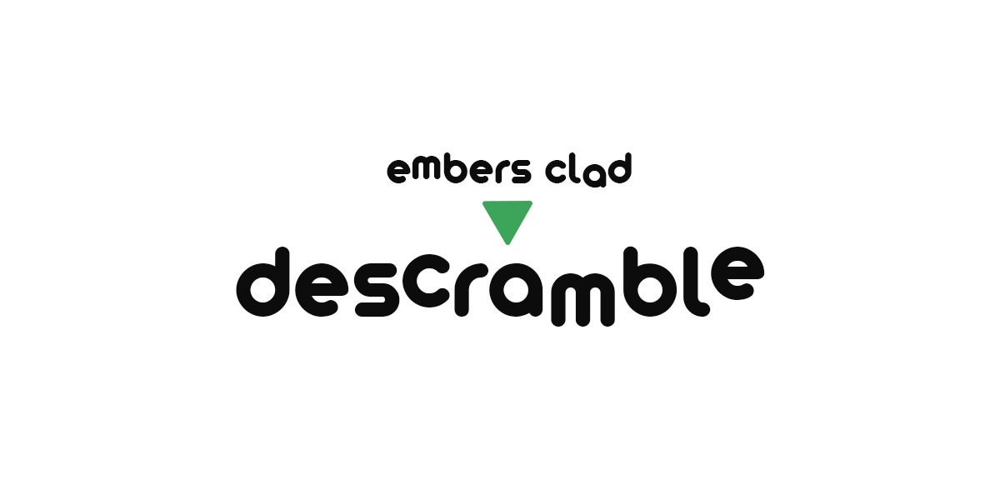

# Descramble



A multiple-word anagram descrambler written in Rust.

**Descramble** solves anagrams with multiple-word solutions while ensuring more likely and frequent solutions get recommended amongst a sea of potential solutions using NLP and word frequencies.

## Installation

Download and extract one of the releases at the [Releases](https://github.com/a22Dv/Descramble/releases) section of this repository.

## Getting Started

After extraction, run:
```
./descramble
```
to use the program. 

You can pass command-line arguments to the program to change its behavior. Run:
```
./descramble -h
```
To get the full list of arguments.
Here's a sample request.
```
./descramble "Built to stay free." -w 3 -s 1 -t 100
```

It says to solve the anagram "Built to stay free.", focusing on solutions made up of 3 words, set the threshold to 1, and show the top 100 results. 
>[!WARNING]
>The `-s`/`--strength` flag may potentially exclude the correct solution. It sets a threshold to further exclude words >that may not meet the frequency threshold. Making sure that less common words aren't considered.

### Customization

You may add or remove words or templates from the data the program works on, located in the `data/` directory.
`data/data.json` holds the english words, their frequency and their corresponding POS tag in isolation.
`data/templates.json` holds the part of speech tag templates that the program will match solutions to. 


### Sample Output:
```
PS C:\> descramble "Built to stay free." -w 3 -s 1 -t 30
statue of liberty / liberty of statue - 12.57%
of astute liberty                     - 12.57%
titles for beauty / beauty for titles - 5.14%
briefly out state                     - 1.51%
tribute safely to                     - 1.35%
briefly statue to                     - 1.35%
briefly astute to                     - 1.35%
fly out batteries                     - 1.23%
files out battery / battery out files - 1.23%
flies out battery                     - 1.22%
felis out battery / battery out felis - 1.22%
briefly out testa                     - 1.21%
briefly out teats                     - 1.21%
briefly out tates                     - 1.21%
after busy toilet                     - 0.68%
after busy lottie                     - 0.67%
buys after toilet                     - 0.66%
buys after lottie                     - 0.65%
early best outfit                     - 0.49%
early best fitout                     - 0.48%
outfit belt years / years belt outfit - 0.48%
fitout belt years / years belt fitout - 0.47%
outfit years blet / outfit blet years - 0.46%
```
### Disclaimer

>[!NOTE]
> It is **NOT** guaranteed that the program will rank your solution higher up.
> The program uses probabilitistic techniques as well as NLP to rank solutions, therefore
> even if it is guaranteed that the program will find the correct solution so long as the
> constituent words are in `data.json`, you might not see them in the top-most entries.
> You may pipe the output to a .txt file to prevent results from being cut off from the
> console history if they get too long.
## License

This project is licensed under the MIT license - see LICENSE for more details.

## Author

a22Dv - a22dev.gl@gmail.com